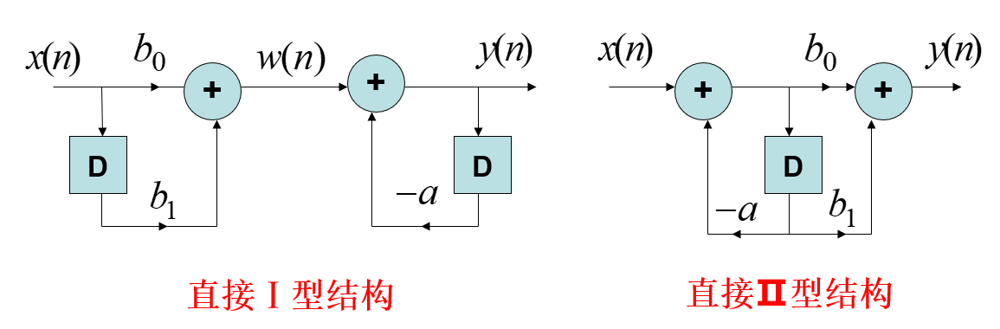

# 信号与线性系统期末复习

## 1. 信号与系统

正弦信号

> 连续时间正弦信号：$x(t)=A\cos(\Omega_0t+\phi)$
>
> 基波周期：$T_0=\dfrac{2\pi}{\Omega_0}$
>
> 离散时间正弦序列：$x(n)=A\cos(\omega_0n+\phi)$
>
> 满足周期性的条件：$\dfrac{\omega_0}{2\pi}=\dfrac{m}{N}$ 为有理数。

指数信号

> 连续时间指数信号：$x(t)=Ae^{at}$
>
> （1）$A,a$ 为实常数：实指数信号
>
> （2）$A=1,a=j\Omega_0$：周期性复指数信号，$T=\dfrac{2k\pi}{\Omega_0}$
>
> $x(t)=e^{j\Omega_0t}=\cos(\Omega_0t)+j\sin(\Omega_0t)$
>
> 离散时间指数序列：$x(n)=K\alpha^n$
>
> （1）$k,\alpha$ 为实常数：实指数序列
>
> （2）$k=1,\alpha=e^{j\omega_0}$：周期性复指数序列，$N=\dfrac{2\pi m}{\omega_0}$（$\dfrac{\omega_0}{2\pi}$ 为有理数）
>
> $x(n)=e^{j\omega_0n}=\cos(\omega_0n)+j\sin(\omega_0n)$

单位阶跃信号

> 连续单位阶跃信号：
>
> $u(t)=\begin{cases}0,&t<0\\1,&t\geq0\end{cases}$
>
> 离散单位阶跃序列：
>
> $u(n)=\begin{cases}0,&n<0\\1,&n\geq0\end{cases}$

单位脉冲信号

> $\delta(n)=\begin{cases}0,&n\neq0\\1,&n=0\end{cases}$
>
> $x(n)\delta(n)=x(0)\delta(n)$
>
> $x(n)\delta(n-m)=x(m)\delta(n-m)$

单位冲激信号

> 单位冲激函数 $\delta(t)$ 的定义：
>
> $\begin{cases}\delta(t)=0,&t\neq0\\\int_{-\infty}^{+\infty}\delta(t)dt=1\end{cases}$
>
> $x(t)\delta(t)=x(0)\delta(t)$
>
> $x(t)\delta(t-t_0)=x(t_0)\delta(t-t_0)$

系统的性质

> 因果性：如果一个系统在任何时刻的输出都只取决于当时的输入以及以前的输入，而不取决于将来的输入，则该系统就称为**因果系统**。例如，$y(n)=x(n)+x(n-1)$ 是因果系统，而 $y(n)=x(n)-x(n+1)$ 是非因果系统。
>
> 时不变性：如果系统的输入信号在时间上发生一个时移，相应的输出信号也仅仅在时间上产生一个同样的时移，除此之外没有任何其他改变，则称该系统为**时不变系统**。
>
> 线性性：如果一个系统既满足叠加性同时又满足齐次性，则称该系统为**线性系统**。
>
> 所谓叠加性是指，几个激励同时作用于系统时，系统的响应等于每个激励单独作用时所产生的相应之和，即
>
> 若 $x_1(t)\rightarrow y_1(t),x_2(t)\rightarrow y_2(t)$，则 $x_1(t)+x_2(t)\rightarrow y_1(t)+y_2(t)$。
>
> 所谓齐次性是指，若系统的输入乘以任意常数，则系统的输出也乘以相同的常数，即
>
> 若 $x(t)\rightarrow y(t)$，则 $kx(t)\rightarrow ky(t)$。

## 2. 信号与系统的时域分析

离散信号的时域分解

> $\displaystyle x(n)=\sum_{k=-\infty}^{+\infty}x(k)\delta(n-k)$

离散时间系统的时域分析方法

> $\displaystyle x(n)=\sum_{k=-\infty}^{+\infty}x(k)\delta(n-k)\rightarrow y(n)=\sum_{k=-\infty}^{+\infty}x(k)h(n-k)=x(n)*h(n)$

卷积和的定义

> $\displaystyle x(n)*h(n)=\sum_{k=-\infty}^{+\infty}x(k)h(n-k)$

卷积和的性质

> 交换律：$x(n)*h(n)=h(n)*x(n)$
>
> 结合律：$[x(n)*h_1(n)]*h_2(n)=x(n)*[h_1(n)*h_2(n)]$
>
> 分配律：$x(n)*[h_1(n)+h_2(n)]=x(n)*h_1(n)+x(n)*h_2(n)$
>
> 时移性质：$x(n-n_0)*h(n)=x(n)*h(n-n_0)=y(n-n_0)$
>
> $x(n)*\delta(n)=x(n)$
>
> $x(n-n_1)*\delta(n-n_2)=x(n-n_1-n_2)$
>
> $x(n)*u(n)\displaystyle=\sum_{k=-\infty}^{n}x(k)$

离散 LTI 系统的模拟框图

> $y(n)+ay(n-1)=b_0x(n)+b_1x(n-1)$
>
> $y(n)=-ay(n-1)+b_0x(n)+b_1x(n-1)$
>
> $\begin{cases}w(n)=b_0x(n)+b_1x(n-1)\\y(n)=-ay(n-1)+w(n)\end{cases}$

卷积的定义

> $f_1(t)*f_2(t)=\int_{-\infty}^{+\infty}f_1(\tau)f_2(t-\tau)d\tau$

卷积的性质

> 交换律：$f(t)*v(t)=v(t)*f(t)$
>
> 分配律：$f(t)*[v(t)+w(t)]=f(t)*v(t)+f(t)*w(t)$
>
> 结合律：$[f(t)*v(t)]*w(t)=f(t)*[v(t)*w(t)]$
>
> 时移性质：$f(t-t_1)*v(t-t_2)=y(t-t_1-t_2)$
>
> $x(t)*\delta(t)=x(t)$
>
> $x(t-t_0)*\delta(t-t_1)=x(t-t_0-t_1)$

卷积的微分与积分

> 微分：$\displaystyle\frac{\mathrm d}{\mathrm dt}\left[f(t)*v(t)\right]=\frac{\mathrm df(t)}{\mathrm dt}*v(t)=f(t)*\frac{\mathrm dv(t)}{\mathrm dt}$
>
> 积分：$\int_{-\infty}^t\left[f(\tau)*v(\tau)\right]d\tau=f(t)*\left[\int_{-\infty}^tv(\tau)d\tau\right]=\left[\int_{-\infty}^tf(\tau)d\tau\right]*v(t)$

常用函数的卷积

> $f(t)*\delta(t)=f(t)$
>
> $f(t)*\delta(t-t_0)=f(t-t_0)$
>
> $f(t)*\delta'(t)=f'(t)*\delta(t)=f'(t)$
>
> $f(t)*u(t)=\int_{-\infty}^tf(\tau)d\tau$
>
> $u(t)*u(t)=tu(t)$
>
> $e^{-t}u(t)*u(t)=(1-e^{-t})u(t)$

## 3. 连续时间信号与系统的频域分析

周期信号

> 如果连续时间信号 $x(t)$ 是周期的，则对任何 $t$ 都应满足 $x(t)=x(t+T)$。其中，$T$ 是一个非零的正实数。满足上式的最小非零正值 $T_0$ 称为该信号的**基波周期**，$\Omega_0=\dfrac{2\pi}{T_0}$ 称为**基波频率**。
>
> 如果把成谐波关系的复指数信号线性组合起来，构成一个连续时间信号 $x(t)$，即 $x(t)\displaystyle=\sum_{k}a_ke^{jk\Omega_0t}$，那么 $x(t)$ 也一定是以 $T_0$ 为周期的。在上式中，由于 $k=0$ 的项是一个常数，因而称为 $x(t)$ 的**直流分量**；$k=\pm1$ 的两项都具有基波周期 $T_0$，因而被合称为 $x(t)$ 的**基波分量**或**一次谐波分量**。

指数形式的傅里叶级数

> $\displaystyle x(t)=\sum_{k=-\infty}^{+\infty}\dot A_ke^{jk\Omega_0t}$
>
> $\dot A_k=\dot A_{-k}^*$

傅里叶级数的系数

> $\dot A_k=\dfrac{1}{T_0}\displaystyle\int_{T_0}x(t)e^{-jk\Omega_0t}dt$

三角函数形式的傅里叶级数

> $x(t)=\dot A_0+2\displaystyle\sum_{k=1}^{\infty}\text{Re}\left\{\dot A_ke^{jk\Omega_0t}\right\}$
>
> $x(t)=A_0+2\displaystyle\sum_{k=1}^{\infty}A_k\cos(k\Omega_0t+\varphi_k)$
>
> $x(t)=A_0+2\displaystyle\sum_{k=1}^\infty \text{Re}\left\{A_ke^{j(k\Omega_0t+\varphi_k)}\right\}$
>
> $x(t)=A_0+2\displaystyle\sum_{k=1}^\infty \left[ a_k\cos k\Omega_0t-b_k\sin k\Omega_0t\right]$

三角函数系数和指数函数系数关系

> 直流分量：$A_0=\dot A_0$
>
> 余弦分量（偶分量）：$a_k=\dfrac{1}{2}\left(\dot A_k+\dot A_{-k}\right)$
>
> 正弦分量（奇分量）：$b_k=\dfrac{1}{2j}\left(\dot A_k-\dot A_{-k}\right)$

周期函数奇偶性与谐波分量的关系

> 周期偶函数：只有直流和 $a_n$ 项，$b_n=0$
>
> 周期奇函数：只有 $b_n$ 项，直流和 $a_n=0$
>
> 奇谐函数：奇谐函数的偶次谐波的系数为 $0$，只含奇次谐波
>
> 偶谐函数：偶谐函数的奇次谐波的系数为 $0$，只含偶次谐波

非周期信号的傅里叶变换

> $X(j\Omega)=\int_{-\infty}^{+\infty}x(t)e^{-j\Omega t}\mathrm dt$
>
> $x(t)=\dfrac{1}{2\pi}\int_{-\infty}^{+\infty}X(j\Omega)e^{j\Omega t}\mathrm d\Omega$

周期信号的傅里叶变换

> $e^{j\Omega_0t}\leftrightarrow 2\pi\delta(\Omega-\Omega_0)$
>
> $x(t)\leftrightarrow 2\pi\displaystyle\sum_{k=-\infty}^{+\infty}\dot A_k\delta(\Omega-k\Omega_0)$

常用信号的傅里叶变换对

| 信号 $x(t)$ | 傅里叶变换 $X(j\Omega)$ |
| :---------: | :---------------------: |
| $e^{-at}u(t),a>0$ | $\dfrac{1}{a+j\Omega}$ |
| $e^{-a\|t\|},a>0$ | $\dfrac{2a}{a^2+\Omega^2}$ |
| $1$ | $2\pi\delta(\Omega)$ |
| $\delta(t)$ | $1$ |
| $u(t)$ | $\dfrac{1}{j\Omega}+\pi\delta(\Omega)$ |
| $\begin{cases}1,&\|t\|\leq \tau/2\\0,&\|t\|>\tau/2\end{cases}$ | $\dfrac{2\sin\left(\Omega\tau/2\right)}{\Omega}$ |
| $\text{sgn}(t)=u(t)-u(-t)$ | $\dfrac{2}{j\Omega}$ |
| $e^{j\Omega_0t}$ | $2\pi\delta(\Omega-\Omega_0)$ |
| $\begin{cases}1,&0\leq \|t\|\leq \tau/2\\0,&\tau/2<\|t\|\leq T_0/2 \end{cases}$ | $\displaystyle\sum_{k=-\infty}^{+\infty}\dfrac{2\sin(k\Omega_0\tau/2)}{k}\delta(\Omega-k\Omega_0)$ |
| $te^{-at}u(t),\text{Re}(a)>0$ | $\dfrac{1}{(a+j\Omega)^2}$ |

傅里叶变换的基本性质

| 性质 | 傅里叶变换 |
| :--: | :--------: |
| 线性特性 | $ax(t)+by(t)\leftrightarrow aX(j\Omega)+bY(j\Omega)$ |
| 延时特性 | $x(t-t_0)\leftrightarrow X(j\Omega)e^{-j\Omega t_0}$ |
| 移频特性 | $x(t)e^{j\Omega_0t}\leftrightarrow X(j(\Omega-\Omega_0))$ |